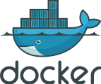
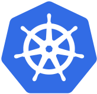
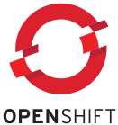
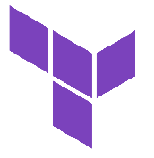

# Software Overview

Here's a quick guide to the main tools our team uses to build and run software.

## Docker

**What is it?** Think of Docker like a lunchbox for software. Instead of installing an app and hoping it works on every computer, you pack everything it needs (the app, its settings, a mini operating system) into one neat "container" that runs the same way everywhere.

- **Why is it useful?** No more "it works on my computer but not yours" problems.
- **Real-world analogy:** It's like a phone app. You download it and it just works, no matter what phone you have.
- You can use containers other people have built, or create your own.

**Want to learn more?** [Docker overview and tutorial](https://docker-curriculum.com/)

## GitLab

**What is it?** GitLab is where we store our code and work together on it. Think of it like Google Docs but for code. Multiple people can work on the same project without overwriting each other's work.

## Kubernetes

**What is it?** Kubernetes (often shortened to "K8s") is like a manager for all our Docker containers. When you have lots of containers running, you need something to keep them organised. It starts them up, shuts them down, and makes sure they're healthy.

- **Real-world analogy:** Imagine a head teacher managing hundreds of students. They make sure everyone is in the right classroom, arrange a substitute if a teacher calls in sick, and open more classrooms if the school gets busier.
- It can automatically run more copies of your app when lots of people are using it.

**Want to learn more?** [What is Kubernetes?](https://kubernetes.io/docs/concepts/overview/what-is-kubernetes/)

## OpenShift

**What is it?** OpenShift is Kubernetes with extra features added on top. It's like going from a basic phone to one with a protective case, screen protector, and pre-installed apps. It makes Kubernetes easier and safer to use in a big organisation like ours.

- It adds security and management tools that large teams need.
- It gives developers a friendlier interface to work with.

**Want to learn more?** [OpenShift Interactive Learning Portal](https://developers.redhat.com/learn)

## Jenkins

**What is it?** Jenkins is our "robot assistant" that automatically builds, tests, and releases our software. Every time a developer saves new code, Jenkins picks it up and checks it works properly without anyone having to do it manually.

- **Real-world analogy:** It's like a spell checker that runs automatically every time you finish writing a paragraph, but for code. It checks for bugs instead of typos.
- It can also automatically put the finished software live on the internet for users.

**Want to learn more?** [What is Jenkins?](https://www.jenkins.io/doc/#what-is-jenkins)

## Helm

**What is it?** Helm is a tool that helps us set up applications on Kubernetes without having to write out every single setting by hand each time. It uses templates (like a form where you fill in the blanks) so we can reuse the same setup across different projects.

- **Real-world analogy:** It's like using a template in Word or Google Docs. You don't redesign the whole document every time, you just fill in the parts that change.

**Want to learn more?** [Introduction to Helm](https://helm.sh/docs/chart_template_guide/)

## Terraform

**What is it?** Instead of clicking around a website Terraform lets us create and manage our computer infrastructure (servers, databases, networks) by writing it down in code. You describe what you want, and Terraform builds it for you.

- **Real-world analogy:** It's like a lego instruction manual. Instead of assembling things by guessing, you follow the plan and if you need another identical lego masterpiece, you just follow the same instructions again.
- If something goes wrong, you can tear it all down and rebuild it exactly the same way in minutes.

**Want to learn more?** [What is Terraform?](https://developer.hashicorp.com/terraform/intro)